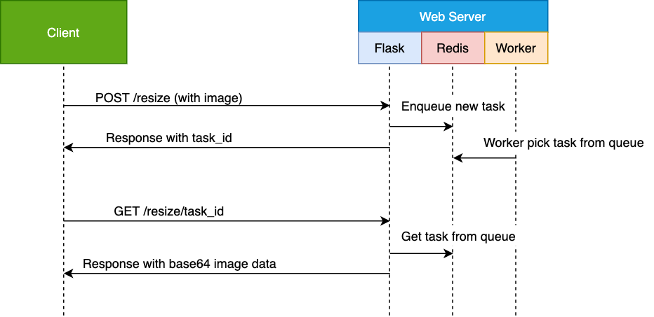

# Simple Image resize service in Python and Queue based architecture
### Objective:
To make API to resize image. Image processing is time consuming, so Async architecture is suitable to handle all upcoming requests.
In this project I used Redis based RQ where I enqueue all the requests to Queue stack. Worker will work in behind to process the tasks.

Task id will return to response and passing task_id to different request desired result might get.

Let's see the following diagram to understand easily.

### Components:
- Web server (Python Flask)
- Python Library: Pillow, Redis, RQ
- Docker

### How to run, API endpoints and response
- Clone the project and move to project directory
- Before run check your 5000 port is not used by other services in localhost and you have docker installed in system
- Run command: <pre>docker-compose up --build</pre>
- In terminal run following commands to check
    - To resize request
        - <pre>curl -i -X POST -H "Content-Type: multipart/form-data" -F "file=@test.jpeg" http://0.0.0.0:5000/resize</pre>
        - Response:  <pre>{"data":{"task_id":Task ID},"status":"success"}</pre>
    - To get the result:
        - <pre>curl http://0.0.0.0:5000/resize/[task_id]</pre>
        - Response:  <pre>{"data": "image base64 data", "status":"success"}</pre>
- To unit test in different terminal run following command. Note: 'image_resize_web_1' may different in your case, use your container name
    - <pre>docker exec -it image_resize_web_1 sh test/test.sh</pre>